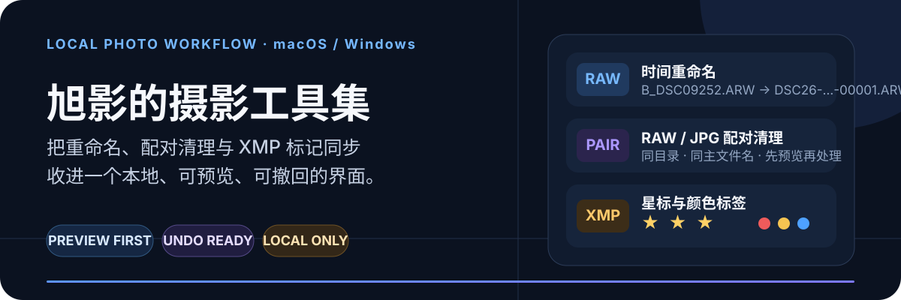
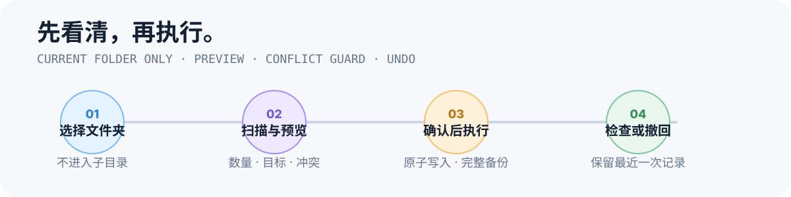

<p align="center">
  
</p>

<p align="center">
  <a href="LICENSE"></a>
  
  
  
  
</p>

<p align="center">
  <a href="#下载">下载</a> ·
  <a href="#三个功能">三个功能</a> ·
  <a href="#安全工作流">安全工作流</a> ·
  <a href="docs/使用说明.md">完整使用说明</a> ·
  <a href="#从源码运行">源码运行</a>
</p>

旭影的摄影工具集是一款面向摄影师的本地图形工具。它只处理你选中的**当前文件夹**，把拍摄时间重命名、RAW/JPG 配对清理，以及 Adobe XMP 星标与颜色标签同步放进同一个可预览、可撤回的流程。

> 所有照片、路径和元数据都在本机处理。它是批量整理工具，不是独立备份方案；第一次使用请先拿少量副本验证。

## 下载

### Windows 10/11 x64 · v1.0.17 测试版

- [下载安装版（推荐）](https://github.com/xuying-studio/xuying-photo-toolkit/releases/download/v1.0.17/xuying-photo-toolkit-v1.0.17-windows-x64-setup.exe)
- [下载免安装便携版](https://github.com/xuying-studio/xuying-photo-toolkit/releases/download/v1.0.17/xuying-photo-toolkit-v1.0.17-windows-x64-portable.zip)
- [查看发布说明与 SHA-256](https://github.com/xuying-studio/xuying-photo-toolkit/releases/tag/v1.0.17)

Windows 包已经包含 Python 和运行依赖，按当前用户安装，不要求管理员权限。此测试版尚未进行代码签名，首次打开可能出现 SmartScreen；请确认文件来自本仓库后选择“更多信息 → 仍要运行”。

### macOS 11+ · v1.0.10

- [下载 Universal2 DMG（推荐）](https://github.com/xuying-studio/xuying-photo-toolkit/releases/download/v1.0.10/xuying-photo-toolkit-v1.0.10-macos-universal.dmg)
- [下载 Universal2 ZIP](https://github.com/xuying-studio/xuying-photo-toolkit/releases/download/v1.0.10/xuying-photo-toolkit-v1.0.10-macos-universal.zip)
- [查看 v1.0.10 发布说明](https://github.com/xuying-studio/xuying-photo-toolkit/releases/tag/v1.0.10)

macOS 包同时支持 Apple Silicon 与 Intel Mac，当前使用 ad-hoc 签名、尚未经过 Apple Developer ID 公证；其他 Mac 首次打开时可能需要右键选择“打开”。

## 三个功能

| 功能 | 解决什么问题 | 文件保护 |
| --- | --- | --- |
| **时间重命名** | 按 EXIF 拍摄时间统一 RAW、JPG 和 XMP 文件名，保留扩展名大小写 | 冲突即停止、两阶段改名、保存撤回清单 |
| **RAW/JPG 配对清理** | 找出同目录下缺少配对 RAW 或 JPG 的孤立文件 | 先预览；Windows 移入回收站，macOS 移入废纸篓 |
| **星标与颜色同步** | 在同名 RAW/JPG 间双向同步常见 Adobe XMP Rating / Label | 不直接写 RAW；JPG 写入前备份，批次失败自动回滚 |

三个页面共享同一个照片文件夹，但都只扫描当前层级，不进入备份或其他子目录。扩展名匹配不区分大小写，`.ARW/.arw` 与 `.JPG/.jpg` 可以组合使用。

## 安全工作流

<p align="center">
  
</p>

- **扫描不修改文件**：先列出数量、目标、标记变化与冲突。
- **重命名不覆盖**：目标已存在或多文件指向同一目标时直接停止。
- **RAW 不直接写入**：元数据只创建或更新 XMP 侧车。
- **JPG 先保留完整备份**：写入使用临时文件替换，失败会恢复本批次目标。
- **清理不做永久删除**：Windows 使用系统回收站；macOS 使用废纸篓和恢复记录。

## 三步上手

1. 复制一小组 RAW、JPG 和 XMP 到测试文件夹。
2. 选择功能页和当前文件夹，点击“扫描并预览”。
3. 核对列表与统计后再执行；完成后在 Bridge、Finder 或文件资源管理器中检查结果。

完整命名规则、恢复机制、数据目录和常见问题见 [docs/使用说明.md](docs/使用说明.md)。

## 功能规则速览

### 时间重命名

```text
B_DSC09252.ARW      → DSC26-08-25-00001.ARW
B_DSC09252.JPG      → DSC26-08-25-00001.JPG
B_DSC09252.xmp      → DSC26-08-25-00001.xmp
```

- 优先读取 EXIF 拍摄时间，读取失败时使用文件修改时间。
- RAW、JPG、XMP 的扩展名保留原大小写。
- `照片名.xmp` 与 `照片名.RAW.xmp` 会保留各自命名方式一起改名。
- 已符合格式的文件保持不变，编号从当日已有最大值继续。

### RAW/JPG 配对清理

配对只发生在当前文件夹内，并按不区分大小写的同名主文件名判断：

```text
A001.JPG  ↔  a001.ARW
```

Windows 会尝试从回收站定位并恢复本次清理文件；若回收站已清空、文件被手动移动、原位置出现同名文件或系统元数据不可用，可能无法自动恢复。

### Adobe XMP 星标与颜色同步

- `RAW → JPG`：读取 RAW 侧车中的 Rating / Label，写入同名 JPG 的内嵌 XMP。
- `JPG → RAW`：读取 JPG 的内嵌 XMP，创建或更新同名 RAW 侧车。
- 星标与颜色标签可以单独选择，但至少选择一项。

支持常见 Adobe XMP 写法，包括 `xmp:` / `xap:` 前缀、属性或元素形式、单双引号，以及 UTF-8 / UTF-16 RAW 侧车。不同 Bridge 版本、重复 XMP、Extended XMP、缓存状态或第三方软件生成的元数据仍建议先用样本验证。

<details>
<summary><strong>支持的照片格式</strong></summary>

JPG / JPEG，以及：

`ARW`、`CR2`、`CR3`、`CRW`、`NEF`、`NRW`、`RAF`、`RW2`、`ORF`、`PEF`、`DNG`、`X3F`、`3FR`、`FFF`、`SRW`、`MRW`、`MOS`、`ERF`、`IIQ`、`KDC`、`MEF`、`RAW`、`GPR`。

</details>

## 兼容性与边界

- Windows v1.0.17 是未签名的 x64 测试版，不是 ARM Windows 原生包。
- macOS v1.0.10 尚未公证。
- 应用只扫描当前文件夹，不递归处理子目录。
- 配对依据是同目录、同主文件名；不会跨目录猜测配对。
- Bridge 对缓存、多份 XMP 或 Extended XMP 的显示可能与系统文件属性不同。
- 网络盘、移动盘、受保护目录、超长路径或被其他软件占用的文件需要实际验证。
- 预览表最多展示 1,000 行，但不会缩小实际扫描范围。
- 请保留独立备份；撤回记录不能替代备份。

## 从源码运行

```bash
git clone https://github.com/xuying-studio/xuying-photo-toolkit.git
cd xuying-photo-toolkit
python3 -m pip install -r requirements.txt
python3 main.py
```

要求 Python 3.10+ 和可用的 Tkinter。Windows 构建需要 64 位 Python 与 Inno Setup；macOS 构建需要系统签名与磁盘镜像工具。

<details>
<summary><strong>构建 Windows 与 macOS 安装包</strong></summary>

Windows：

```powershell
py -3.10 -m pip install -r requirements.txt
.\build_windows.ps1
```

macOS：

```bash
chmod +x build_app.sh
./build_app.sh
```

Windows 也可以通过仓库的 `Windows build` GitHub Actions 工作流构建。

</details>

## 本地数据与隐私

应用没有照片上传、云同步或遥测功能。透明度设置、重命名撤回清单、XMP 备份和最近一次清理记录保存在当前用户的应用数据目录；详细路径见 [本地数据与隐私](docs/使用说明.md#8-本地数据与隐私)。

## 贡献与反馈

- 使用问题或功能建议：[GitHub Issues](https://github.com/xuying-studio/xuying-photo-toolkit/issues)
- 参与开发：[CONTRIBUTING.md](CONTRIBUTING.md)
- 安全问题：[SECURITY.md](SECURITY.md)

请勿在公开 Issue 中上传真实照片、完整私人路径、回收站记录或含敏感信息的 EXIF/XMP 文件。

## 其他语言

[中文](README.md) · [English](README.en.md) · [日本語](README.ja.md) · [Español](README.es.md) · [한국어](README.ko.md) · [العربية](README.ar.md)

## 许可证

[MIT License](LICENSE) © 2026 旭影
