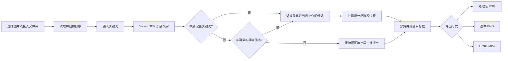

# 关键词对齐器实现原理说明

## 一句话概括

这个程序不会代替用户搜索百度和截图。它接收用户准备好的截图，使用 macOS 自带的 Vision OCR 找出每张图中的关键词，再通过统一的缩放与平移，把关键词放到同一个目标框里，最后导出 PNG、逐帧 PNG 或无声 MP4。

> [!info] 核心思路
> 不是让关键词本身移动，而是移动和缩放整张截图。关键词只是用来计算整张截图应该放大多少、向哪个方向移动。

## 完整处理流程



## 技术选型

| 功能 | 使用的技术 | 选择原因 |
|---|---|---|
| Mac 界面 | SwiftUI | 原生、体积小，适合拖拽、文件选择和实时预览 |
| 中文文字识别 | Apple Vision | 完全本地运行，不需要上传截图或购买 OCR 接口 |
| 图片变换 | Core Graphics + AppKit | 可以精确控制画布尺寸、缩放、平移和白色补边 |
| MP4 编码 | AVFoundation / AVAssetWriter | macOS 原生 H.264 编码，不依赖外部 FFmpeg |
| 项目构建 | Swift Package Manager | 当前机器没有完整 Xcode，也能编译和打包 |
| 设置保存 | UserDefaults + JSON | 保存常用画面规格，不保存用户截图和完整项目 |

## 程序结构

项目分成两个主要模块：

| 模块 | 作用 |
|---|---|
| `KeywordAlignerCore` | 数据模型、时间计算、对齐几何公式 |
| `KeywordAlignerApp` | SwiftUI 界面、文件导入、OCR、图片渲染和视频导出 |

关键文件：

- `Sources/KeywordAlignerCore/Models.swift`：画面比例、输出模式、OCR 候选框和对齐公式。
- `Sources/KeywordAlignerCore/TimelineMath.swift`：总帧数、视频时长和时间显示。
- `Sources/KeywordAlignerApp/ProjectStore.swift`：管理所有图片、设置、识别进度和导出进度。
- `Sources/KeywordAlignerApp/OCRService.swift`：调用 Vision OCR 并筛选关键词。
- `Sources/KeywordAlignerApp/ImageRenderer.swift`：按照计算结果生成最终画面。
- `Sources/KeywordAlignerApp/ExportService.swift`：导出 PNG、逐帧 PNG 和 MP4。
- `Sources/KeywordAlignerApp/ContentView.swift`：项目设置页、编辑器和拖拽交互。

## 1. 图片和文件夹是怎样导入的

程序支持两种入口：

1. 使用系统文件选择器选择多张图片或一个文件夹。
2. 将图片或文件夹直接拖进窗口。

导入规则：

- 支持 `PNG`、`JPG`、`JPEG`、`HEIC`。
- 文件夹只读取当前层，不递归扫描子文件夹。
- 自动忽略隐藏文件、文件夹和不支持的格式。
- 使用规范化后的绝对路径去重，避免同一张图片被重复加入。
- 新加入的图片按文件名自然排序，例如 `2.jpg` 会排在 `10.jpg` 前面。
- 导入后仍可以在左侧队列拖动调整顺序。

## 2. OCR 是怎样找到关键词的

OCR 使用 `VNRecognizeTextRequest`，主要设置为：

- 精确识别模式：`.accurate`。
- 语言：简体中文 `zh-Hans` 和英文 `en-US`。
- 启用系统语言修正。
- 每个文字区域读取最多 3 个候选结果。

### 2.1 先统一文字格式

百度结果中的关键词可能夹杂空格、标点或大小写差异。程序比较文字前会：

- 去掉空格和标点。
- 保留中文、英文和数字。
- 将英文统一为小写。

例如：

```text
婚礼 摄影 → 婚礼摄影
Wedding Photography → weddingphotography
```

### 2.2 优先完整匹配

如果 OCR 结果中包含完整关键词，程序会取得关键词自身的文字框，而不是把整行标题都当作关键词。

当一张图里出现多个相同关键词时，计算每个候选框中心与画面中心 `(0.5, 0.5)` 的距离，默认选择距离最近的候选。

### 2.3 模糊匹配作为后备

如果没有完整匹配，程序会使用 Levenshtein 编辑距离寻找相近文字。只有相似度达到 `0.70` 才接受，避免只识别到“婚礼”两个字时，把半个词误认为完整的“婚礼摄影”。

如果仍然找不到可靠候选：

- 不强行放大错误文字。
- 将原图等比缩放并居中放入画布。
- 在左侧列表和右侧检查区显示“未识别”提示。

> [!warning] OCR 不是百分之百正确
> 低清晰度、文字被裁切、特殊字体或复杂背景都可能导致识别失败。程序会显示候选框，用户可以点击另一个候选结果进行修正。

## 3. 坐标为什么要转换

Vision OCR 使用左下角作为坐标原点，而 SwiftUI 预览和程序的对齐逻辑使用左上角作为原点。

因此 OCR 返回的矩形需要转换：

```text
新 y = 1 - Vision 矩形最大 y
```

所有文字框都保存成 `0–1` 的归一化坐标。这样无论输入图片和输出视频是多少像素，都可以复用同一套目标框和公式。

## 4. 缩放和平移是怎样计算的

设：

- 输入截图宽度为 `Wi`。
- 输出画布宽度为 `Wo`。
- OCR 关键词框的归一化宽度为 `Sw`。
- 用户目标框的归一化宽度为 `Tw`。

关键词原始像素宽度：

```text
关键词原始宽度 = Sw × Wi
```

关键词目标像素宽度：

```text
关键词目标宽度 = Tw × Wo
```

整张截图的统一缩放倍数：

```text
scale = 关键词目标宽度 ÷ 关键词原始宽度
```

得到缩放倍数后，再计算整张截图的左上角位置：

```text
originX = 目标框中心 X - 关键词中心 X × scale
originY = 目标框中心 Y - 关键词中心 Y × scale
```

最终效果是：

- 关键词中心与目标框中心一致。
- 关键词宽度与目标框宽度一致。
- 整张截图保持原始宽高比，不会被拉伸变形。

目标框的宽度决定缩放大小；目标框的中心决定关键词位置。目标框高度主要用于显示和确定纵向中心，不单独拉伸文字。

### 为什么允许白色补边

用户选择的是“关键词严格对齐”。因此当截图移动后边缘不够覆盖画布时，程序不会擅自再次放大，而是使用白色背景补齐。这样可以保证关键词的位置和大小不被破坏。

### 为什么预览和导出能够一致

SwiftUI 预览和最终图片渲染共同使用 `AlignmentMath.geometry` 计算变换。预览不是近似模拟，导出时也不会重新使用另一套算法。

## 5. 总帧数和视频时长怎样计算

每张图片使用相同的保持帧数，默认是 4 帧。

```text
总帧数 = 图片数量 × 每张保持帧数
视频时长 = 总帧数 ÷ 输出帧率
```

例如：

```text
20 张 × 每张 4 帧 = 80 帧
80 ÷ 29.97fps ≈ 2.669 秒
```

界面同时显示：

- 总帧数。
- `HH:MM:SS.mmm` 格式的预计时长。
- 保留两位小数的中文摘要。

输入限制：

- 每张保持帧数：`1–10000` 的整数。
- 输出帧率：`1–120fps`。
- 输出宽高：`64–8192` 像素，并且必须是偶数。

## 6. 三种导出方式怎样实现

### 6.1 处理后 PNG

每张输入图片只渲染一次，输出到指定尺寸的 sRGB 画布中，文件名类似：

```text
001-原文件名.png
002-原文件名.png
```

### 6.2 逐帧 PNG

每张图片先完成一次对齐和 PNG 编码，然后复用同一份 PNG 数据，按照“每张保持帧数”生成连续编号：

```text
000001.png
000002.png
000003.png
000004.png
...
```

如果有 20 张图片、每张保持 4 帧，最终会得到 80 张 PNG。

### 6.3 MP4

MP4 使用 `AVAssetWriter` 编码：

- 视频编码：H.264 High Profile。
- 画面尺寸：用户选择的分辨率。
- 帧率：用户选择的帧率。
- 每张图片连续写入指定帧数。
- 图片之间直接硬切，不增加滚动、淡入淡出或补帧。
- 不创建音频轨，因此是无声视频。

## 7. 23.976、29.97 和 59.94fps 为什么要特殊处理

这些常见视频帧率不是简单的整数。程序使用有理数时间基：

| 界面帧率 | 视频时间基 |
|---|---|
| 23.976 | 24000 / 1001 |
| 29.97 | 30000 / 1001 |
| 59.94 | 60000 / 1001 |

同时把 MP4 的电影时间基和视频轨时间基设为同一精度，避免最后一帧被容器裁短。

其他自定义帧率会按千分之一精度转换成有理数，不会粗暴取整成整数，但也不代表任意无限小数都能无限精确保存。

## 8. 设置和缓存怎样保存

程序使用 `UserDefaults` 保存有效的 `ProjectSettings`，包括：

- 画面比例和宽高。
- 帧率。
- 每张保持帧数。
- 关键词。
- 目标框位置和大小。
- 导出模式。

不会保存：

- 导入的图片列表。
- OCR 识别结果。
- 完整项目文件。

OCR 在当前运行期间会使用内存缓存，缓存键由“规范化图片路径＋文件修改时间＋关键词”组成。只调整画面比例、帧率或保持帧数时，不需要重新运行 OCR。

## 9. 打包方式

项目使用 Swift Package Manager：

```bash
swift build -c release --product KeywordAlignerApp --arch arm64
```

`scripts/build-app.sh` 会：

1. 编译 Apple Silicon 发行版。
2. 创建标准 `.app` 目录结构。
3. 写入 `Info.plist`。
4. 进行本机 ad-hoc 签名。
5. 输出 `dist/关键词对齐器.app`。

> [!note] 签名说明
> 当前是本机 ad-hoc 签名，不是 Apple Developer ID 公证发行版。适合当前 Mac 本地使用；如果以后公开分发给其他用户，需要开发者证书、正式签名和 Apple 公证。

## 10. 当前已经完成的验证

- 发行版能够编译并从 Finder 双击启动。
- App 包签名和 `Info.plist` 检查通过。
- 自检脚本验证了总帧数、时长和关键词几何对齐公式。
- 6 张测试截图导出逐帧 PNG：应为 24 张，实测为 24 张。
- 6 张测试截图导出 30fps MP4：实测 24 帧、0.800 秒。
- 使用 20 张真实截图识别“婚礼摄影”：20 张均找到完整匹配。
- 20 张真实截图、每张 4 帧、29.97fps：
  - 界面预计：80 帧、约 2.669 秒。
  - 实际视频：1080×1920、H.264、`30000/1001fps`、80 帧、2.669333 秒。

当前机器只安装了 Command Line Tools，没有完整 Xcode，因此 XCTest 测试套件无法在此环境启动；项目仍保留 XCTest 文件，另外使用可独立运行的 `run-self-check.sh` 和真实导出流程完成验证。

## 11. 当前版本明确不做的事情

- 不自动打开百度或搜索关键词。
- 不自动截图。
- 不生成连续滚动动画。
- 不逐张设置不同的保持帧数。
- 不导出剪映工程。
- 不添加声音、转场和补帧。
- 不把图片或 OCR 数据上传到网络。

这些限制保证第一版只专注于一个目标：**快速把一批截图里的同一个关键词对齐，并生成可以直接用于剪辑的素材。**
